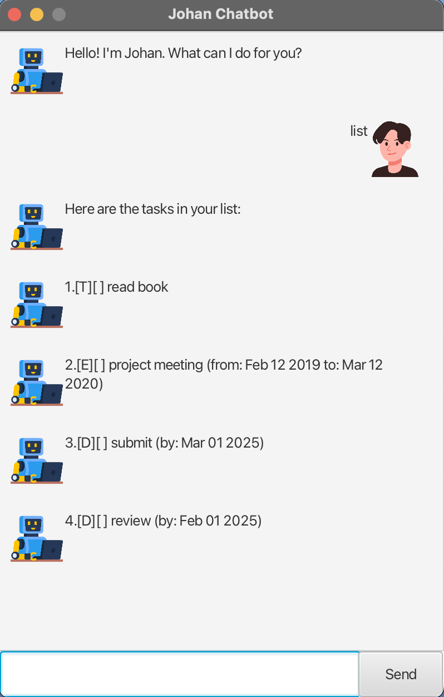

<!-- Johan Chatbot User Guide -->
# Johan Chatbot User Guide

Johan Chatbot is a JavaFX-based task manager that lets you organize your todos, deadlines, and events through a simple chat interface. Type commands in the text field and hit "Send" to manage your tasks efficiently.

## Quick Start

1. Download `johan.jar` from [releases](https://github.com/jhwan0707/ip/releases) or build it with `./gradlew shadowJar`.
2. Run it: `java -jar build/libs/johan.jar`.

## Adding Deadlines

Add a task with a due date to keep track of time-sensitive duties.

- **Command**: `deadline <description> /by <date>`
- **Examples**:
    - `deadline submit report /by 2025-03-01`
    - `deadline pay bills /by 01/03/2025`
- **Outcome**: Adds a deadline to your list, displayed as `[D][ ] <description> (by: Mar 1 2025)`.

## Managing Tasks

### Listing Tasks
View all your tasks in the current order.

- **Command**: `list`
- **Example**: `list`
- **Outcome**: Shows all tasks with numbers (e.g., `1. [D][ ] submit report (by: Mar 1 2025)`).

### Marking Tasks
Mark tasks as done or undone.

- **Command**: `mark <number>` or `unmark <number>`
- **Examples**: `mark 1`, `unmark 1`
- **Outcome**: Updates task status (e.g., `[D][X] submit report` or `[D][ ] submit report`).

### Deleting Tasks
Remove a task from your list.

- **Command**: `delete <number>`
- **Example**: `delete 1`
- **Outcome**: Deletes the task at position 1.

## Sorting Tasks

Sort deadlines chronologically and other tasks alphabetically.

- **Command**: `sort`
- **Example**: `sort`
  - Before: `1. [D][ ] submit /by 2025-03-01`, `2. [D][ ] review /by 2025-02-01`
  - After: `1. [D][ ] review /by 2025-02-01`, `2. [D][ ] submit /by 2025-03-01`
- **Outcome**: Reorders tasks (e.g., deadlines by date, todos alphabetically).

## Searching Tasks

### Finding Tasks
Search tasks by keyword.

- **Command**: `find <keyword>`
- **Example**: `find report`
- **Outcome**: Lists matching tasks (e.g., `1. [D][ ] submit report (by: Mar 1 2025)`).

### Tasks on a Date
View tasks due or occurring on a specific date.

- **Command**: `on <date>`
- **Example**: `on 2025-03-01`
- **Outcome**: Shows relevant tasks (e.g., deadlines due on March 1, 2025).

## Exiting

Close the chatbot and save your tasks.

- **Command**: `bye`
- **Example**: `bye`
- **Outcome**: Exits the app, saving tasks to `data/johan.txt`.

## Notes

- Task numbers are 1-based.
- Dates can be `YYYY-MM-DD` or `DD/MM/YYYY`.
- Commands are case-insensitive.